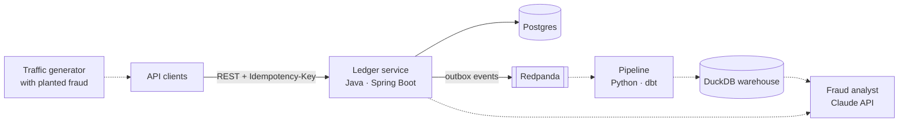

# Clearhouse

A small payments platform, built in layers: a **double-entry ledger** that moves money
correctly under concurrency, a **data pipeline** that turns its event stream into a
warehouse, and an **AI fraud analyst** that triages suspicious transfers and is scored
against labelled fraud.

[](https://github.com/KevST14/clearhouse/actions/workflows/ci.yml)
[](https://openjdk.org/projects/jdk/21/)
[](LICENSE)



Solid lines exist today; dotted ones are on the [roadmap](#roadmap).

## Running it

You need Java 21 and Docker.

```bash
docker compose up -d
```

```bash
cd ledger && ./mvnw spring-boot:run
```

Open an account, fund it from the outside world, then pay someone:

```bash
curl -s localhost:8080/accounts -H 'Content-Type: application/json' \
  -d '{"ownerName": "Alice", "currency": "GBP"}'
```

```bash
curl -s localhost:8080/transfers -H 'Content-Type: application/json' -H 'Idempotency-Key: deposit-1' \
  -d '{"fromAccountId": "00000000-0000-0000-0000-000000000826", "toAccountId": "<alice id>", "amountMinor": 10000, "currency": "GBP"}'
```

Every transfer is also published to the `ledger.transfers` topic. Browse it in
Redpanda Console at http://localhost:8081.

Run the tests (they start their own Postgres and Redpanda in Docker):

```bash
cd ledger && ./mvnw verify
```

## Ledger API

| Method | Path | What it does |
| --- | --- | --- |
| `POST` | `/accounts` | Open a customer account (`GBP`, `EUR` or `USD`) |
| `GET` | `/accounts/{id}` | Account with its current balance |
| `GET` | `/accounts/{id}/entries` | Latest 100 ledger entries, newest first |
| `POST` | `/transfers` | Move money. Requires an `Idempotency-Key` header |
| `GET` | `/transfers/{id}` | A single transfer |

`POST /transfers` returns `201` for a new transfer and `200` with `Idempotent-Replayed: true`
when the key was already used for the same request. Errors are
[RFC 9457](https://www.rfc-editor.org/rfc/rfc9457) `application/problem+json`: `400` for an
invalid request, `404` for an unknown account, and `422` for insufficient funds, mixed
currencies, or a key reused for a different transfer.

## Events

Each transfer publishes one message to the `ledger.transfers` topic, keyed by the paying
account so that account's transfers stay in order on one partition:

```json
{
  "eventId": "82f53a98-6db8-41ac-b147-d2642dd54331",
  "eventType": "transfer.created",
  "occurredAt": "2026-10-02T16:20:29.303257Z",
  "data": {
    "transferId": "8a78060c-299c-48de-ad8d-c3684e1aa2be",
    "fromAccountId": "00000000-0000-0000-0000-000000000826",
    "toAccountId": "154a625a-c1c6-45b6-9a8f-876d15c25664",
    "amountMinor": 5000,
    "currency": "GBP",
    "createdAt": "2026-10-02T16:20:29.303257Z"
  }
}
```

Delivery is at-least-once, so consumers should ignore an `eventId` they have already seen.

## Design notes

**Money is an integer.** Amounts are `long` minor units (pence, cents). Floating point
can't represent 0.10 exactly, and rounding errors in a ledger compound.

**Every transfer is double-entry.** A transfer writes one negative entry for the payer
and one positive entry for the payee, so entries always net to zero. Money enters and
leaves through one `EXTERNAL` account per currency (id ending in the ISO 4217 code,
e.g. `…0826` for GBP), which is the only account allowed to go negative. That makes
the sum of all balances in a currency exactly zero, and the tests check this after
every test, along with "each balance equals the sum of its entries".

**Retries are safe.** Clients send an `Idempotency-Key` with each transfer. Retrying
with the same key and body returns the original transfer instead of paying twice. Two
identical requests racing each other are resolved by a unique constraint: the loser
rolls back and replies with the winner's result.

**Concurrency: queue rather than retry.** The first version used optimistic locking
(`@Version`) and retried on conflict. The concurrency tests (eight threads shuffling money
between three accounts) showed retries colliding over and over until some transfers
gave up. Transfers now lock both account rows (`SELECT … FOR UPDATE`) in id order before
reading balances, so concurrent transfers wait their turn and can't deadlock.
`@Version` stays as a safety net. The tests were also checked against a build with the
lock removed, where they fail with lost updates and overdrafts.

**Events go through a transactional outbox.** Writing to the database and then sending to
Kafka can't be done atomically: a crash in between either loses the event or announces a
transfer that rolled back. Instead, the transfer writes its event into an `outbox_events`
table in the same transaction, so both commit or neither does. A publisher polls for
unpublished rows (`FOR UPDATE SKIP LOCKED`), sends them, and marks them published. If it
dies after sending but before marking, the batch is sent again, which is why delivery is
at-least-once. After every test, the tests check that each transfer has exactly one event
and that no event outlived a rolled-back transfer, including when 20 threads race the same
idempotency key.

**Known limit: one publisher.** `SKIP LOCKED` lets several publishers share the work
safely, but two of them could then send one account's events out of order. The service
should run a single publisher until that's handled.

**Known limit: the hot external account.** Every deposit locks the same external
account, so deposits are serialised. Splitting it into shards is on the roadmap.

## Roadmap

**1. Ledger core** (`ledger/`)
- [x] Accounts, double-entry transfers, per-account statements
- [x] Idempotency keys with replay and conflict detection
- [x] Row locking with concurrency and invariant tests against real Postgres
- [x] Transactional outbox publishing `transfer.created` events to Redpanda
- [ ] Delete published outbox rows after a retention period
- [ ] OpenAPI docs
- [ ] Reversals as compensating transfers
- [ ] Shard the external account to remove the deposit hot spot

**2. Data pipeline** (Python)
- [ ] Traffic generator with labelled fraud patterns: card testing, mule fan-in, velocity spikes
- [ ] Consumer that lands raw events
- [ ] dbt models in DuckDB: account features, rolling velocity windows
- [ ] Data quality checks and scheduled runs

**3. AI fraud analyst** (Python + Claude API)
- [ ] Tools for querying the warehouse and an account's ledger history
- [ ] Triage flagged transfers and write a case note explaining the decision
- [ ] Evaluation harness: precision and recall against the planted fraud labels

**4. Dashboard** (TypeScript, optional)

## Layout

```
compose.yaml          Postgres, Redpanda and Redpanda Console for local runs
ledger/               Spring Boot service
  src/main/.../account    Accounts and balance rules
  src/main/.../transfer   Transfers, ledger entries, idempotency, transfer events
  src/main/.../outbox     Transactional outbox and Kafka publisher
  src/main/.../web        Error responses
  src/main/resources/db/migration   Flyway schema
```

## License

MIT
