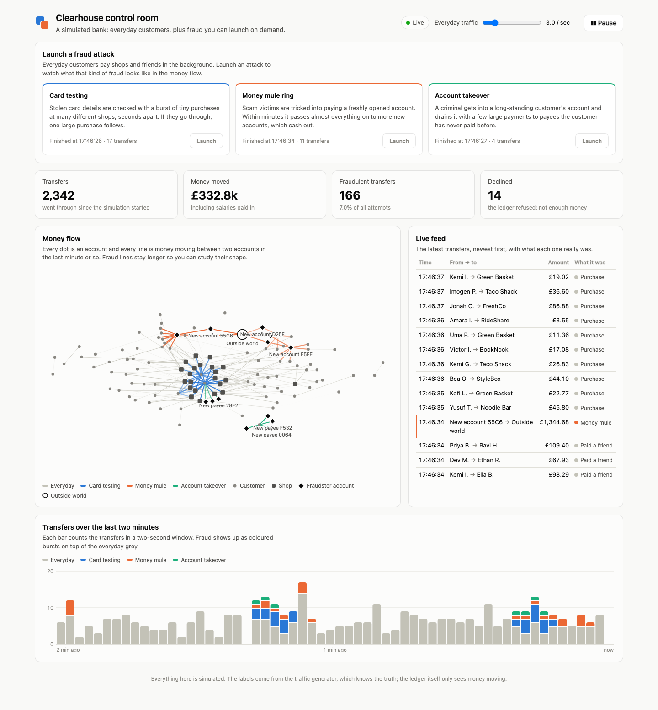
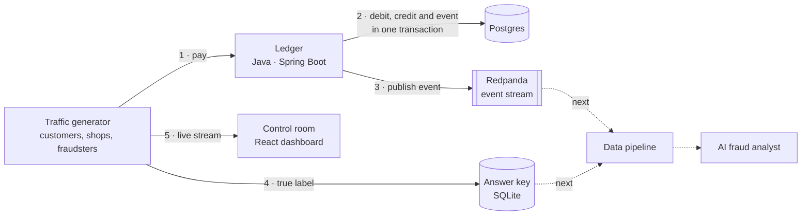

# Clearhouse

**A small, working model of how a bank moves money safely, and of how fraud hides inside that money.**

[](https://github.com/KevST14/clearhouse/actions/workflows/ci.yml)
[](https://openjdk.org/projects/jdk/21/)
[](https://www.python.org/)
[](LICENSE)

<picture>
  <source media="(prefers-color-scheme: dark)" srcset="docs/dashboard-dark.png">
  
</picture>

<sub>The control room, a few seconds after launching all three fraud attacks. Each colour is a different
kind of fraud: blue is card testing, orange is a money mule ring, green is an account takeover.</sub>

---

**Contents:** [What is this?](#what-is-this) · [Try it](#try-it) · [How it fits together](#how-it-fits-together) ·
[The pieces](#the-pieces-one-at-a-time) · [How I built it](#how-i-built-it-the-thinking-behind-each-decision) ·
[Glossary](#glossary) · [Roadmap](#roadmap)

## What is this?

When you tap "pay" in a banking app, a lot has to go right behind the scenes:

- **The money must add up.** It leaves one account and arrives in another; it is never created or lost.
- **It must happen exactly once,** even if your phone loses signal and sends the request again.
- **Other systems must hear about it,** such as statements, analytics and fraud checks.
- **Someone has to spot fraud.** Criminals hide among millions of honest payments.

Clearhouse is a small version of that back office, built from scratch so I could learn how each of those
jobs is actually done. It has four parts today:

| Part | In plain English | Built with |
| --- | --- | --- |
| [**Ledger**](#1-the-ledger) | The bank's book of record. Holds every account and moves money between them, following strict accounting rules. | Java, Spring Boot, Postgres |
| [**Event stream**](#2-events-telling-the-rest-of-the-bank) | A noticeboard where the ledger announces every transfer, so other systems can react. | Redpanda (Kafka-compatible) |
| [**Traffic generator**](#3-the-traffic-generator) | 120 simulated customers and 22 shops using the bank, plus fraudsters you can unleash. It keeps an "answer key" of which transfers were fraud. | Python, FastAPI |
| [**Control room**](#4-the-control-room) | The live dashboard above: watch money move and see what each kind of fraud looks like. | React, TypeScript |

The next two parts are a **data pipeline** that turns the event stream into analysable tables, and an **AI
fraud analyst** that investigates suspicious transfers and is scored against the answer key.

## Try it

You need [Java 21](https://adoptium.net/), [Docker](https://www.docker.com/products/docker-desktop/),
[uv](https://docs.astral.sh/uv/) for Python and [Node 24](https://nodejs.org/) (with
[nvm](https://github.com/nvm-sh/nvm), `nvm use` in `dashboard/` picks the right version).
Run each step in its own terminal, from the repository root:

```bash
docker compose up -d
```

```bash
cd ledger && ./mvnw spring-boot:run
```

```bash
cd generator && uv run trafficgen
```

```bash
cd dashboard && nvm use && npm install && npm run dev
```

Open **http://localhost:5180** and press **Launch** on any attack. The ledger is on port 8080, the
generator's API on 8090, and [Redpanda Console](http://localhost:8081) on 8081 if you want to see the raw events.

## How it fits together



**The journey of one payment**, say Priya buying a coffee:

1. The generator decides Priya is buying a £3.80 coffee at Bean There and asks the ledger to move the money,
   attaching a unique *idempotency key* so a retry can never charge her twice.
2. The ledger locks both accounts, checks Priya can afford it, and in **one database transaction** writes a
   −£3.80 entry for her, a +£3.80 entry for the shop, and a note announcing the transfer. Either all of it
   is saved or none of it is.
3. A background job picks up the note and publishes it to the event stream.
4. The generator records the transfer in its answer key as *everyday* (if it had been a fraudster, it
   would say which kind).
5. The dashboard receives it instantly and draws a dot travelling from Priya to the shop.

Solid arrows exist today; dotted ones are on the [roadmap](#roadmap).

## The pieces, one at a time

### 1. The ledger

**What it does.** Opens accounts and moves money between them through a small REST API. Think of a bank's
master spreadsheet with rules that can't be broken:

| Rule | Why it matters |
| --- | --- |
| Money is stored as whole pence, never decimals | Computers can't store 0.10 exactly as a decimal; tiny rounding errors add up across millions of payments. |
| Every transfer writes two matching entries, minus for the payer and plus for the payee (*double-entry*) | Every penny can be traced, and you can prove nothing was created or lost. |
| Money enters and leaves through one "outside world" account per currency | Salaries come in from it and cash-outs go back to it, so all balances in a currency always sum to exactly **zero**: an easy, checkable proof the books are right. |
| Customers can never go below zero | The ledger refuses ("declines") a transfer it can't cover. |
| Each transfer carries an idempotency key | Sending the same request twice returns the original transfer instead of paying twice. |
| Both accounts are locked while a transfer runs | Two payments from the same account at the same moment can't both spend the same money. |

**Where to look:** [`ledger/`](ledger), with the money rules in
[`TransferService.java`](ledger/src/main/java/dev/clearhouse/ledger/transfer/TransferService.java) and the
database schema in [`db/migration`](ledger/src/main/resources/db/migration).

<details>
<summary><b>API reference</b></summary>

| Method | Path | What it does |
| --- | --- | --- |
| `POST` | `/accounts` | Open a customer account (`GBP`, `EUR` or `USD`) |
| `GET` | `/accounts/{id}` | Account with its current balance |
| `GET` | `/accounts/{id}/entries` | Latest 100 ledger entries, newest first |
| `POST` | `/transfers` | Move money. Requires an `Idempotency-Key` header |
| `GET` | `/transfers/{id}` | A single transfer |

```bash
curl -s localhost:8080/accounts -H 'Content-Type: application/json' \
  -d '{"ownerName": "Alice", "currency": "GBP"}'
```

```bash
curl -s localhost:8080/transfers -H 'Content-Type: application/json' -H 'Idempotency-Key: deposit-1' \
  -d '{"fromAccountId": "00000000-0000-0000-0000-000000000826", "toAccountId": "<alice id>", "amountMinor": 10000, "currency": "GBP"}'
```

`POST /transfers` returns `201` for a new transfer and `200` with `Idempotent-Replayed: true` when the key
was already used for the same request. Errors are [RFC 9457](https://www.rfc-editor.org/rfc/rfc9457)
`application/problem+json`: `400` for an invalid request, `404` for an unknown account, and `422` for
insufficient funds, mixed currencies, or a key reused for a different transfer. The outside-world
accounts have fixed ids ending in their ISO 4217 currency number: `…0826` GBP, `…0978` EUR, `…0840` USD.
</details>

<details>
<summary><b>How it's tested</b></summary>

The tests run against real Postgres and Redpanda in Docker ([Testcontainers](https://testcontainers.com/)),
not mocks. After **every** test, a set of rules is checked across the whole database: every transfer's
entries net to zero, every balance equals the sum of its entries, every currency sums to zero, and every
transfer has exactly one event. Concurrency tests fire transfers from eight threads at once, including 20
identical requests racing on the same idempotency key and 20 payments trying to overdraw one account.
To check the tests could actually catch bugs, I removed the account lock and confirmed they failed.
</details>

### 2. Events: telling the rest of the bank

**What it does.** Every transfer is announced as an event on the `ledger.transfers` topic, so other systems
(the data pipeline next) can react without asking the ledger.

**The tricky part.** "Save the transfer, then send the announcement" breaks if the program crashes in
between: either the announcement is lost, or a transfer that was rolled back gets announced. The fix is
the **transactional outbox**. The announcement is written into an `outbox_events` table *in the same
transaction* as the transfer, like sealing a note in the same envelope. A background publisher then
posts every unsent note to Redpanda and ticks it off.

If the publisher crashes after posting but before ticking off, the note is posted again. So delivery is
*at-least-once*, and every event carries an `eventId` that readers use to ignore repeats. Each account's
transfers are kept in order by using the paying account as the message key.

<details>
<summary><b>What an event looks like</b></summary>

```json
{
  "eventId": "82f53a98-6db8-41ac-b147-d2642dd54331",
  "eventType": "transfer.created",
  "occurredAt": "2026-10-02T16:20:29.303257Z",
  "data": {
    "transferId": "8a78060c-299c-48de-ad8d-c3684e1aa2be",
    "fromAccountId": "00000000-0000-0000-0000-000000000826",
    "toAccountId": "154a625a-c1c6-45b6-9a8f-876d15c25664",
    "amountMinor": 5000,
    "currency": "GBP",
    "createdAt": "2026-10-02T16:20:29.303257Z"
  }
}
```
</details>

### 3. The traffic generator

**What it does.** Creates a small town of 120 customers and 22 shops (groceries, coffee, transport,
eating out, bills, online), pays everyone an opening salary, then has them behave like people do. Each has
a few favourite shops, pays friends back now and then, and gets topped up when running low. Purchase sizes
follow a *log-normal* curve: most coffees are about £3.80, but there's the occasional big shop, just like
real card data. It all goes through the real ledger, so the ledger's rules apply to the simulation too.

**The fraud.** You can launch three attacks at any time. Each one copies the *shape* that real fraud of that
kind leaves in payment data, because that shape is what detection will have to find:

| Attack | What happens in real life | The shape it leaves |
| --- | --- | --- |
| **Card testing** | Criminals with stolen card details check which ones work using tiny purchases, then spend big on the ones that do. | A burst of 12–20 purchases under £2 at different shops within seconds, then one large online purchase. A *star* from one account. |
| **Money mule ring** | Scam victims are talked into sending money to a newly opened account (the "mule"), which quickly passes it on so it's hard to trace. | Several victims pay one brand-new account, which forwards nearly all of it to more new accounts, which cash out. *Fan-in, then fan-out*. |
| **Account takeover** | A criminal gets into someone's account (a phished password, a SIM swap) and empties it. | An established customer suddenly sends almost their whole balance, in a few large payments, to people they've never paid. |

**The answer key.** The ledger only knows that money moved, not *why*. The generator records the truth
about every transfer (everyday or which attack) in a separate SQLite database. Later, the AI analyst will
be graded against it, the way a model is scored on a test set it never saw.

**Where to look:** [`scenarios.py`](generator/src/trafficgen/scenarios.py) for the behaviours and
[`engine.py`](generator/src/trafficgen/engine.py) for the simulation loop.

<details>
<summary><b>Options and API</b></summary>

```bash
uv run trafficgen --rate 5 --customers 200 --seed 42
```

| Option | Default | Meaning |
| --- | --- | --- |
| `--rate` | `3` | Everyday transfers per second (adjustable live from the dashboard) |
| `--customers` | `120` | How many simulated customers |
| `--seed` | random | Makes the town and its behaviour repeatable |
| `--paused` | off | Start with everyday traffic paused |
| `--ledger-url` | `http://localhost:8080` | Where the ledger is |
| `--db` | `data/simulation.db` | Where the answer key is kept |

The dashboard talks to it over a small API on port 8090: `GET /api/state`, `POST /api/control`
(pause, resume, change rate), `POST /api/scenarios` (launch an attack), `GET /api/transfers/recent`, and
`GET /api/stream`, a [server-sent events](https://developer.mozilla.org/en-US/docs/Web/API/Server-sent_events)
stream of transfers as they happen. When the ledger is busy or the network drops, it retries with the same
idempotency key, so the generator also exercises the ledger's retry safety.
</details>

### 4. The control room

**What it does.** Shows the simulation live, so you can *see* what each fraud looks like:

- **Launch a fraud attack:** one card per attack, with what it is in plain English and how its last run went.
- **Totals:** transfers, money moved, how many were fraudulent, and how many the ledger declined.
- **Money flow:** every dot is an account (grey circles are customers, dark squares are shops, black
  diamonds are accounts fraudsters opened) and every line is money moving in the last minute. A small dot
  travels along the line for each new transfer. Fraud lines are coloured and linger longer, so you can
  study their shape: card testing makes a blue star, a mule ring makes orange fans meeting at one account.
- **Live feed:** the latest transfers in a table, each marked with what it really was.
- **Transfers over the last two minutes:** everyday traffic in grey with fraud stacked on top in colour, so
  a burst stands out immediately.

**Design choices.** Everyday traffic is deliberately a quiet grey so fraud is what catches your eye. The
three fraud colours were run through a colour-blindness checker and stay distinguishable in both light
and dark mode, and every colour is backed by a text label so colour is never the only clue. The network
is drawn on a `<canvas>` with a physics simulation ([d3-force](https://d3js.org/d3-force)) pulling
related accounts together, which is what makes the fraud shapes emerge on their own.

**Where to look:** [`dashboard/src/components`](dashboard/src/components).

## How I built it: the thinking behind each decision

**Why this project.** I wanted one project that teaches the three areas I want to work in (backend
systems for payments, data engineering, and applied AI) and holds together as *one* story rather than
three unrelated demos. A payments platform does that naturally: the backend moves the money, the data
pipeline studies it, and the AI looks for fraud in it. Each layer is built on real output from the one
before it.

**Why start with the ledger.** Everything downstream depends on the data being right. If the ledger can
lose or invent money, nothing built on top can be trusted. So the first thing I wrote wasn't a feature
but a *rule the tests enforce*: after every test, the books must balance.

**Decisions, and what changed my mind along the way:**

1. **Whole pence, not decimals.** Floating-point numbers can't represent most decimal amounts exactly. Using
   whole pence costs nothing and removes a whole class of bugs.
2. **Double-entry with an "outside world" account.** I wanted correctness to be *checkable*, not just
   hoped for. With every transfer netting to zero and money only entering through one account, "do all
   balances sum to zero?" becomes a one-line test that catches almost any bookkeeping bug.
3. **Idempotency keys.** Networks fail mid-request and clients retry; without keys a retry can pay twice.
   Payment APIs like Stripe's work this way, so I copied the pattern, including what happens when two
   identical requests race each other.
4. **Locking: I started with the wrong approach.** My first version used *optimistic locking*: assume no
   conflict, and retry if there was one. The concurrency test (eight threads moving money between the same
   three accounts) showed retries colliding again and again until transfers gave up. This is known as the
   *hot account* problem. I switched to locking both accounts up front, always in the same order so two
   transfers can't deadlock. They now queue instead of failing. The test that exposed the problem is still
   there to stop it coming back.
5. **A bug only Linux could find.** Everything passed on my Mac, but the first CI run on Linux failed: there,
   Java's clock records time in nanoseconds while Postgres stores microseconds, so a transfer's timestamp
   changed after being saved. I reproduced it in a Linux container and now round timestamps when they are
   created. That's why CI runs every test on every push.
6. **The outbox, not "save then send".** Thinking through crash scenarios showed that a simple "save, then
   publish" can lose events or announce transfers that never happened. The outbox makes the event part of
   the same all-or-nothing transaction.
7. **Simulating traffic instead of using a public fraud dataset.** Public datasets are static and anonymised;
   I needed traffic flowing through *my own* ledger, at a rate I control, with fraud I can trigger on
   demand and an exact answer key. I chose three attacks because each leaves a *different* shape (a burst,
   a fan-in-fan-out, a drain to new payees), so a detector will have to learn genuinely different signals.
8. **A network picture in the dashboard.** Fraud is mostly about *relationships*: who pays whom, how fast,
   and whether they've paid each other before. That is hard to see in a table and obvious in a graph,
   which is why the money flow is the centrepiece and the table sits beside it.

**Known limits I'd tackle next:**

- **Every deposit locks the same outside-world account,** so deposits queue behind each other. Splitting it
  into several "shards" would fix this.
- **Only one event publisher should run at a time.** Two publishers could send one account's events out of
  order.
- **Published events are never deleted** from the outbox table yet.

## Glossary

| Term | Meaning |
| --- | --- |
| **Double-entry** | Recording every transfer as a matching minus and plus, so the two always cancel out. |
| **Minor units** | The smallest unit of a currency: pence for pounds, cents for dollars. |
| **Idempotency key** | A unique id sent with a request so that repeating the request has no extra effect. |
| **Row lock** | A database lock on one record, so two transactions can't change it at the same time. |
| **Transaction** | A group of database changes that are saved all together or not at all. |
| **Event / event stream** | A record that something happened, published for other systems to read. Redpanda is a Kafka-compatible event stream. |
| **Transactional outbox** | Saving an event in the same transaction as the change it describes, then publishing it separately. |
| **At-least-once delivery** | Every event is delivered, occasionally more than once, so readers must ignore duplicates. |
| **Card testing** | Trying stolen card details with small purchases to see which work. |
| **Money mule** | An account used to receive and quickly pass on stolen money to hide its trail. |
| **Account takeover** | A criminal gaining control of someone else's account. |
| **Ground truth / answer key** | The known correct label for each transfer, used to score a detector. |
| **Server-sent events** | A simple way for a server to push a stream of updates to a web page. |

## Roadmap

**1. Ledger core** (`ledger/`)
- [x] Accounts, double-entry transfers, per-account statements
- [x] Idempotency keys with replay and conflict detection
- [x] Row locking with concurrency and invariant tests against real Postgres
- [x] Transactional outbox publishing `transfer.created` events to Redpanda
- [ ] Delete published outbox rows after a retention period
- [ ] OpenAPI docs
- [ ] Reversals as compensating transfers
- [ ] Shard the external account to remove the deposit hot spot

**2. Data pipeline** (Python)
- [x] Traffic generator with labelled fraud patterns: card testing, money mules, account takeover
- [ ] Consumer that lands raw events
- [ ] dbt models in DuckDB: account features, rolling velocity windows
- [ ] Data quality checks and scheduled runs

**3. AI fraud analyst** (Python + Claude API)
- [ ] Tools for querying the warehouse and an account's ledger history
- [ ] Triage flagged transfers and write a case note explaining the decision
- [ ] Evaluation harness: precision and recall against the answer key

**4. Control room** (TypeScript)
- [x] Live money-flow network, feed and throughput chart with on-demand attacks
- [ ] Show the analyst's verdicts next to the truth

## Project layout

```
compose.yaml      Postgres, Redpanda and Redpanda Console for local runs
ledger/           The ledger service (Java, Spring Boot)
  .../account       Accounts and balance rules
  .../transfer      Transfers, ledger entries, idempotency, transfer events
  .../outbox        Transactional outbox and Kafka publisher
generator/        Simulated customers, shops and fraudsters (Python)
dashboard/        The control room (React, TypeScript)
docs/             Screenshots
```

## Running the tests

```bash
cd ledger && ./mvnw verify
```

```bash
cd generator && uv run pytest
```

```bash
cd dashboard && npm run build
```

The ledger tests need Docker running. CI runs all three on every push.

## License

MIT
